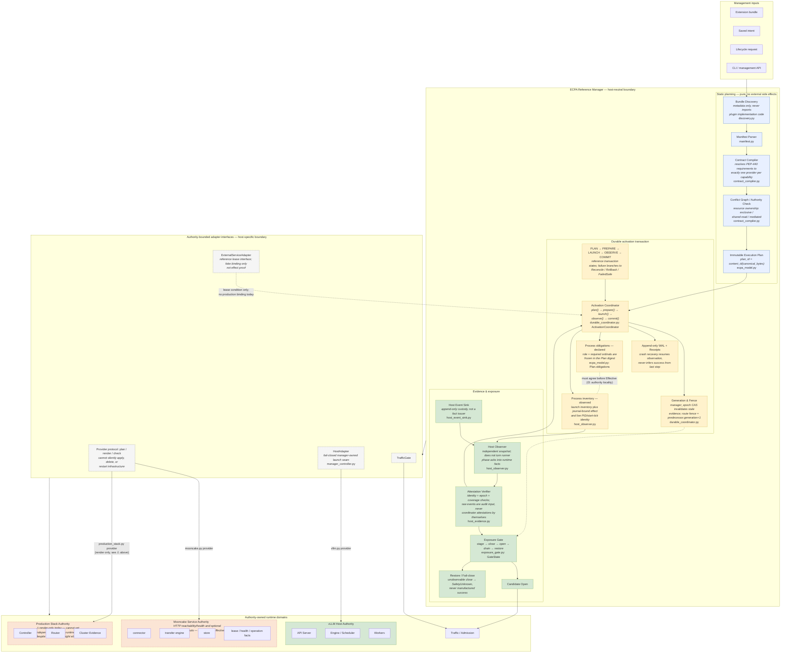

# ECPA Reference Manager — detailed component diagram

This is the fine-grained companion to [`ecpa-architecture.md`](./ecpa-architecture.md)
(the terse Authority graph) and to `fig:architecture` in `paper/main.tex`
(the two-row simplified pipeline the paper actually prints). This diagram is
deliberately more detailed than anything that belongs in the paper: it exists
to think clearly about which module owns which fact, and the paper figure
should stay derivable from it by collapsing each dashed group below into one
box. Do not promote a box's presence here into an implementation or
evaluation status claim — that is what [`evaluation-plan.md`](../evaluation-plan.md)
and `main.tex` Section 7 already track explicitly.

Every node below is labeled with the source module it maps to. Nodes with no
`src/` label are protocol-level concepts (the PLAN→PREPARE→LAUNCH→OBSERVE→COMMIT
workflow, the five evidence facts D/P/I/F/X) that do not live in one file.

## Deliberate corrections against the source-drawn (draw.io) version

These three points are the "fine → coarse" corrections found by cross-checking
every node above against the real module (docstrings, enums, call sites), not
against the diagram alone:

1. **Declared obligations and observed inventory are separate nodes.** The
   safety argument (`main.tex` §3.4, invariant I3) starts with role and ordinal
   targets in `ecpa_model.py: Plan.obligations`; those obligations are part of
   the Plan digest. The concrete launch inventory is created later by
   `HostAdapter.launch()` and persisted by `ActivationCoordinator.launch()`.
   `host_observer.py` then binds journal events to that required inventory and
   independently checks the live Linux PID/start-tick identity. It explicitly
   does not turn runner phase acknowledgements into runtime facts. Calling both
   objects a Plan-owned process inventory would incorrectly move post-launch
   state into the immutable Plan.

2. **Provider health is not runtime-effect evidence.**
   `providers/mooncake.py` performs a real HTTP reachability/health request and
   can consume optional operation counters. Separately,
   `ExternalServiceAdapter` supplies a fail-closed lease condition to the
   reference coordinator, but only deterministic fake implementations exist in
   the current MVP. None of those inputs is a plan/launch/epoch-bound process
   attestation, so none may establish `runtime_effective`.
   `providers/production_stack.py` is
   docstring-labeled **render-only** and projects operator-supplied status; it
   also has no native effect observer. The diagram keeps both limitations
   visible instead of granting either provider the host runtime's authority.

3. **`quarantine_transaction.py` is intentionally absent** from this diagram.
   It backs `experiments/false_effective/runner.py` and
   `formal_lifecycle_source.py` — i.e. it is evaluation-harness / fault-injection
   tooling, not a component of the reference manager itself. Its correct home
   is a separate evaluation-architecture diagram, not this one; re-adding it
   here would blur the manager/harness boundary the paper itself insists on
   (§3.2: harness sources are trusted evidence components, not part of the SUT).

## How this collapses into `fig:architecture`

The paper's printed figure is this diagram with each dashed group merged into
one box: `STATIC` → *Contract compiler (conflicts, order, coverage)*; `TXN` +
`EVID` → *Transactional runtime (prepare→activate→observe)* plus *Evidence
verifier* plus *ExposureGate*; `ADAPT` → *Typed host adapter*; `RUNTIME` →
*Host execution paths*. Points 1 and 2 above are exactly the kind of detail
that a reader of the paper figure does not need and should not see — but they
are exactly what this working diagram exists to keep straight while the
implementation is still being built out.
